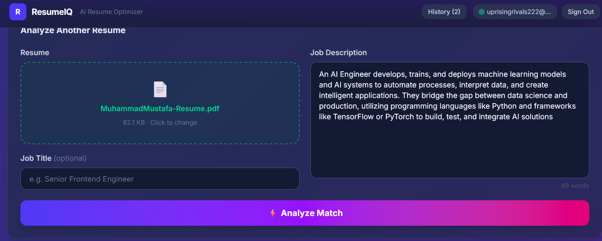
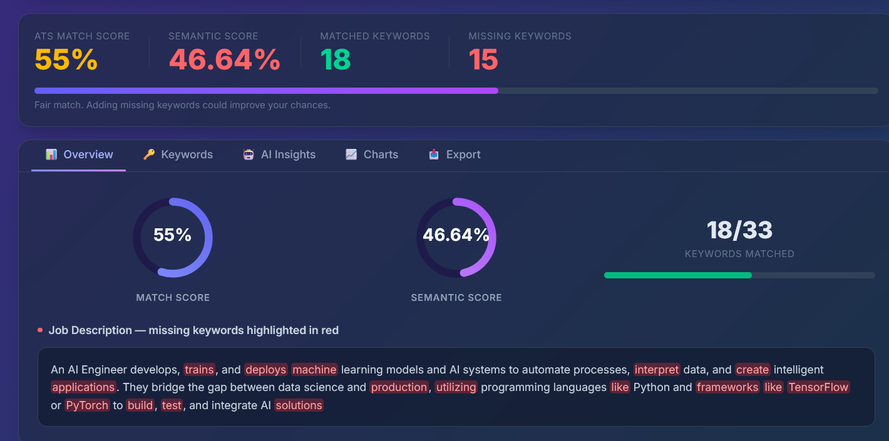
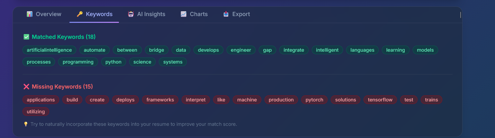
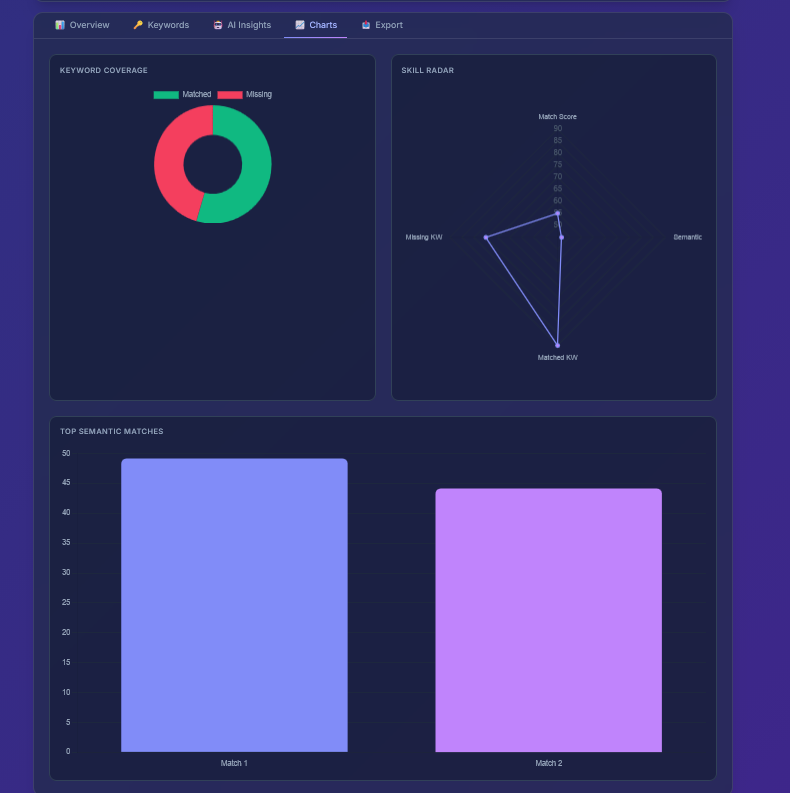
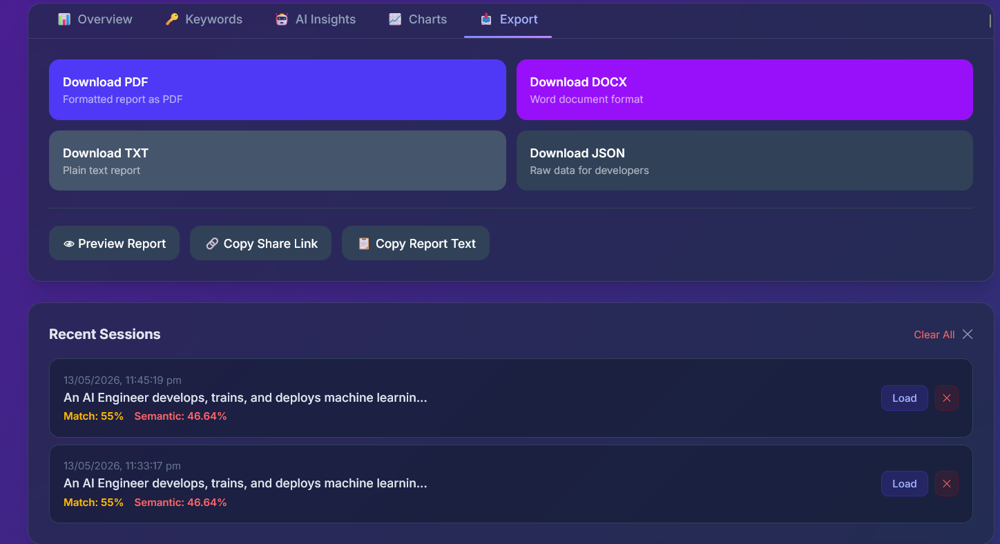

# ResumeIQ — AI Resume Optimizer

An AI-powered resume analysis tool that matches your resume against job descriptions, scores keyword coverage, and gives improvement suggestions — all running locally with no data sent to the cloud.

## Features

- ATS match score + semantic similarity score
- Keyword gap analysis (matched vs missing)
- AI summary, missing skills, and bullet point improvements
- Export report as PDF, DOCX, TXT, or JSON
- Shareable report links
- Session history saved locally
- User accounts via Supabase (optional)











## Tech Stack

| Layer    | Tech                                      |
|----------|-------------------------------------------|
| Frontend | Next.js 15, Tailwind CSS, Chart.js        |
| Backend  | FastAPI, Python 3.13                      |
| AI       | Ollama (local LLM) + sentence-transformers|
| Auth/DB  | Supabase                                  |

---

## Setup

### Prerequisites

- Python 3.10+
- Node.js 18+
- [Ollama](https://ollama.com) installed and running locally

---

### 1. Clone the repo

```bash
git clone https://github.com/YOUR_USERNAME/resume-optimizer.git
cd resume-optimizer
```

---

### 2. Ollama (local AI — no API key needed)

Ollama runs on your machine. Install it from [ollama.com](https://ollama.com), then:

```bash
# Pull a model (choose one)
ollama pull gemma3        # 4GB, fast
ollama pull qwen2.5:14b   # 14GB, more accurate

# Start Ollama
ollama serve
```

By default the app uses `gemma3:latest`. To change it, set the env var in `backend/.env`:

```
OLLAMA_MODEL=qwen2.5:14b
```

---

### 3. Supabase (for auth + session saving)

1. Go to [supabase.com](https://supabase.com) → **New Project**
2. After it creates: **Settings → API**, copy:
   - **Project URL**
   - **anon / public key**
3. Create `frontend/.env.local`:

```env
NEXT_PUBLIC_SUPABASE_URL=your_project_url
NEXT_PUBLIC_SUPABASE_ANON_KEY=your_anon_key
NEXT_PUBLIC_API_URL=http://localhost:8000
```

4. In Supabase dashboard → **SQL Editor**, run:

```sql
create table resume_sessions (
  id uuid default gen_random_uuid() primary key,
  user_id uuid references auth.users not null,
  job_title text,
  score integer,
  skills jsonb,
  created_at timestamptz default now()
);

alter table resume_sessions enable row level security;

create policy "Users see own sessions"
  on resume_sessions for all
  using (auth.uid() = user_id);
```

---

### 4. Backend

```powershell
cd backend

# Create virtual environment (Windows)
python -m venv .venv --without-pip
.\.venv\Scripts\Activate.ps1

# Copy pip into venv (avoids Windows hang issue)
Copy-Item "C:\PythonXXX\Lib\site-packages\pip" ".venv\Lib\site-packages\pip" -Recurse -Force

# Install dependencies
pip install -r requirements.txt

# Start server
uvicorn main:app --reload
```

> **Linux/Mac:**
> ```bash
> python -m venv .venv
> source .venv/bin/activate
> pip install -r requirements.txt
> uvicorn main:app --reload
> ```

---

### 5. Frontend

```powershell
cd frontend
npm install
npm run dev
```

---

### 6. Open the app

| Service        | URL                          |
|----------------|------------------------------|
| App            | http://localhost:3000        |
| Backend API    | http://localhost:8000        |
| Health check   | http://localhost:8000/health |
| Ollama         | http://localhost:11434       |

---

## Environment Variables

### `frontend/.env.local`

| Variable                    | Description                  |
|-----------------------------|------------------------------|
| `NEXT_PUBLIC_SUPABASE_URL`  | Your Supabase project URL    |
| `NEXT_PUBLIC_SUPABASE_ANON_KEY` | Your Supabase anon key   |
| `NEXT_PUBLIC_API_URL`       | Backend URL (default: `http://localhost:8000`) |

### `backend/.env` (optional)

| Variable       | Description                             | Default        |
|----------------|-----------------------------------------|----------------|
| `OLLAMA_MODEL` | Ollama model to use for AI analysis     | `gemma3:latest`|
| `OLLAMA_URL`   | Ollama server URL                       | `http://localhost:11434` |

---

## Privacy

All AI processing happens locally via Ollama. Your resume and job descriptions are never sent to any external server.
